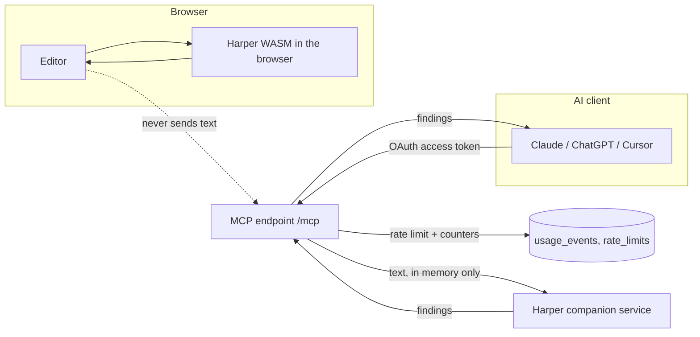

# CEO Owl — privacy-first grammar checking

A grammar checker built on [Harper](https://github.com/Automattic/harper) with
two ways in:

- a **browser editor** where Harper runs entirely on the reader's device, so
  the text never leaves it, and
- a **remote MCP server** so AI clients (Claude, ChatGPT, Cursor, Codex) can
  call one `check_grammar` tool as the signed-in user.

No language model is involved in the analysis. English only. Nothing anyone
submits is ever stored or used for training.

---

## Local development

```bash
bun install
bun run dev          # http://localhost:8080
bun test             # unit + privacy + MCP protocol tests
```

The MCP protocol tests need the dev server running; they skip themselves when
it is not reachable.

### The companion grammar service

Harper's WebAssembly model is roughly 16 MB, which does not fit inside the edge
runtime the web app is deployed to. The browser editor loads Harper directly,
but server-side checks (the MCP tool) delegate to a small companion service.

```bash
bun run services/harper-service/server.ts   # listens on :8787
```

See [`services/harper-service/README.md`](services/harper-service/README.md)
for its contract and Docker deployment. Until `HARPER_SERVICE_URL` is set, the
MCP tool returns a clear `internal` error and the browser editor is unaffected.

---

## Environment variables

Backend values are stored as project secrets, never in the repository.

| Variable | Default | Purpose |
| --- | --- | --- |
| `HARPER_SERVICE_URL` | unset | Base URL of the companion grammar service. Required for MCP checks. |
| `HARPER_SERVICE_TOKEN` | unset | Shared bearer token for that service, when it requires one. |
| `MAX_CHARS_PER_REQUEST` | `10000` | Largest accepted document. |
| `CHECKS_PER_HOUR` | `60` | Per-user hourly allowance, enforced in the database. |
| `REQUEST_TIMEOUT_MS` | `10000` | Upper bound for one server-side check. |

Browser-visible values (`VITE_SUPABASE_URL`, `VITE_SUPABASE_PUBLISHABLE_KEY`,
`VITE_SUPABASE_PROJECT_ID`) are generated by the platform. No private key or
service-role key appears in client code.

---

## Deployment

1. Publish the app. This serves the site and the MCP endpoint at `/mcp`.
2. Deploy the companion service (container image included) and set
   `HARPER_SERVICE_URL` (plus `HARPER_SERVICE_TOKEN` if you enable one).
3. Tune `MAX_CHARS_PER_REQUEST`, `CHECKS_PER_HOUR` and `REQUEST_TIMEOUT_MS` to
   the traffic you expect.
4. Grant yourself the `admin` role to reach the health dashboard:
   insert a row into `user_roles` with your user id and `role = 'admin'`.

---

## MCP setup

Endpoint: `https://<your-domain>/mcp` (Streamable HTTP).

Clients authenticate with OAuth 2.1: adding the endpoint opens a sign-in and
consent screen, and the client then receives a user-scoped access token. There
are no pasted API keys.

```json
{
  "mcpServers": {
    "ceo-owl": {
      "type": "http",
      "url": "https://<your-domain>/mcp"
    }
  }
}
```

One tool is exposed:

`check_grammar(text, language?, include_suggestions?, include_rule_ids?)`

`language` accepts only `"en"`; anything else is rejected with
`unsupported_language`. The `/docs` page documents the full response shape,
error codes and sort order.

### Revoking access

Revoking a client on `/connect` stops future token refreshes. An access token
already issued stays valid until it expires — up to about one hour.

---

## Data flow



Solid lines carry text; the dashed line is the path the editor deliberately
never takes.

---

## Threat model

| Concern | Mitigation |
| --- | --- |
| Text leaking into storage | No column in any table can hold text; a test asserts the schema and the logging allow-list. |
| Text leaking into logs | A single logging helper accepts a fixed set of counters and drops every other key. |
| Text used for training | Harper is a rule-based engine. No model provider is involved, and nothing is retained to train on. |
| One user reading another's data | Row-level security scopes every table to `auth.uid()`; the MCP server has no privileged database client at all. |
| Stolen client credentials | Access is OAuth-only and user-scoped; grants are revocable from `/connect`. |
| Abuse and cost | Per-user hourly limits enforced in the database, plus a hard character cap and a request timeout. |
| Privilege escalation | Roles live in a separate `user_roles` table behind a `SECURITY DEFINER` check, never on a profile row. |

### Security assumptions

- The platform keeps the service-role key and database credentials out of the
  browser bundle; application code never references them.
- The companion grammar service is deployed on infrastructure you control and
  reached over TLS; when exposed publicly, set `HARPER_SERVICE_TOKEN`.
- The OAuth authorization server issues short-lived access tokens signed with
  asymmetric keys, and the MCP endpoint verifies them on every request.
- Browser-side checks are only as private as the user's own device.

### Retention policy

| Data | Retained |
| --- | --- |
| Submitted text, fragments, suggestions, corrected output | Never written anywhere. In memory for the length of one request. |
| Raw IP addresses, auth headers, tokens | Never logged or stored. |
| Usage counters (`usage_events`) | Timestamp, operation, character count, finding count, success, latency, error code. Readable only by the owning user and administrators. |
| Rate-limit counters (`rate_limits`) | A per-user hourly count. |
| Account and OAuth grants | Kept until the user revokes the client or deletes their account. |

---

## Tests

```bash
bun test
```

Covered: empty, oversized, non-string and non-English input; engine output
mapping and deterministic ordering; safe-suggestion application; the logging
allow-list; the absence of any text-bearing column in `usage_events`; MCP
`initialize`, `tools/list` and `tools/call` rejecting unauthenticated and
invalid tokens; and the published authorization-server metadata.

Rate limiting is enforced by the `consume_rate_limit` database function and is
exercised through a signed-in session rather than in the offline suite.

---

## Production-readiness checklist

- [x] Row-level security enabled with per-user policies on every table
- [x] Roles in a dedicated table behind a `SECURITY DEFINER` check
- [x] No text or identifiers in logs or database rows
- [x] Character cap, hourly limit and request timeout configurable by env
- [x] OAuth-only MCP access with a consent screen and revocation
- [x] Automated tests for validation, mapping, privacy and MCP auth
- [ ] Companion grammar service deployed and `HARPER_SERVICE_URL` set
- [ ] An administrator granted the `admin` role for the health dashboard
- [ ] Limits tuned to expected traffic
- [ ] Uptime and error-rate alerting on the companion service

---

## Attribution

Grammar analysis is provided by [Harper](https://github.com/Automattic/harper),
licensed under the Apache License 2.0. The full notice and license link are on
the `/terms` page. This project is **not endorsed by or affiliated with
Automattic**. English only.
